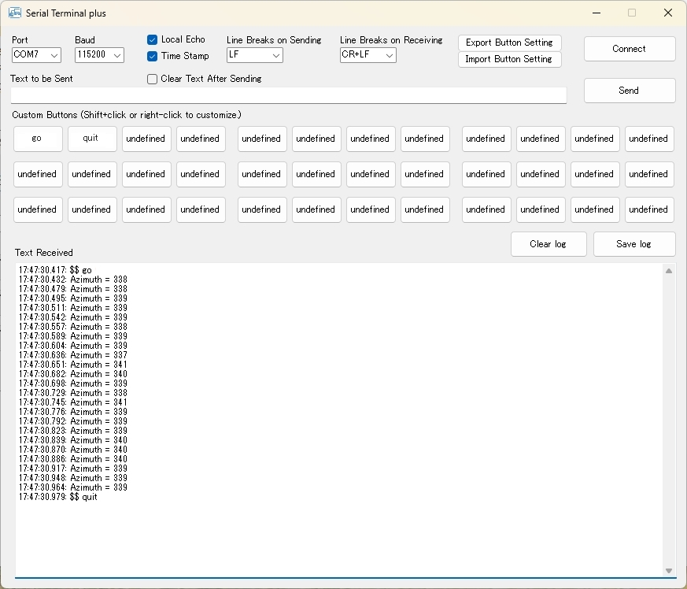

# Serial_Terminal_plus

### Serial terminal app for Windows PC with custom buttons

* This is an application for Windows PC.
* Frequently used transmission strings can be registered using the customizable buttons and sent by clicking.
* The number of buttons that can be registered is 36.
* You can add a timestamp to the beginning of the line when receiving.
* The transmitted string can be included in the received content as a local echo.
* You can save the received contents to a text file.

### Convenient usage

* It is convenient for microcontroller program developers to send commands using serial communications and have the microcontroller perform desired actions in response to those commands. This application can realise this requirement on a Windows PC.
* This application was originally created for communication between a Windows PC and a micro:bit but can be used for serial communication with many microcontrollers.

### How to download

* Open the URL [https://github.com/healthywalk/Serial_Terminal_plus/](https://github.com/healthywalk/Serial_Terminal_plus/)
* Select "Download Zip" from the green button labeled "code".
* "Serial_Terminal_plus-main.zip" will be downloaded, so unzip it.
* You will find "Serial_Terminal_plus.exe" in Serial_Terminal_plus-main \ Serial_Terminal_plus \ bin \ Release.
* You can put "Serial_Terminal_plus.exe" in a convenient place and start it by double-clicking.

### How to use

* Connect the microcomputer to the Windows PC with a USB cable as you would when programming in an integrated development environment using serial communications.
* Close the IDE or other serial communications application that was opened.
* On the microcomputer, run a program that uses serial transmission and serial reception.
* Open "Serial Terminal plus".
* Check the serial port and other settings and press "Connect".
* Enter a suitable text string (alphanumeric characters) in the "Text to be sent" field and press the "Send" button to send the string to the microcomputer.
* The received string from the microcomputer is displayed in "Text Received".
* When you press the "Save" button, you can save the contents of "Text Received" at that time in a text file.
* To register a character string for a custom button, Shift-click the button you want to register. Up to 36 buttons can be used.
* To exit, press the "Disconnect" button and then the exit button on the upper right.

